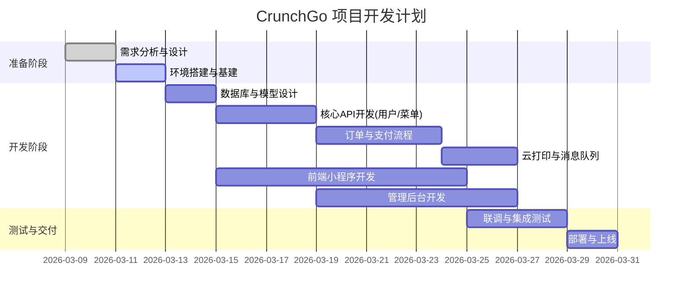

# 总体计划：CrunchGo 单店快餐系统

## 1. 项目概述
**CrunchGo** 是一个面向单店快餐场景的微信小程序点餐系统。
**核心目标**：实现用户端（堂食/自提）流畅点餐、支付、会员积分，以及管理端（后台配置、订单管理）的高效运营，并通过云打印机实现后厨自动出单。

## 2. 核心架构与技术栈

### 技术选型
*   **前端（小程序）**：{{Taro}} + {{Vue3}}
*   **管理后台**：{{Vue3}} + {{ElementPlus/AntDesign}}
*   **后端服务**：{{Python FastAPI}}
*   **数据库**：{{PostgreSQL}} (业务数据)
*   **缓存/消息**：{{Redis}} (库存锁、会话、队列)
*   **基础设施**：{{Docker}} / {{云服务器}}

### 系统逻辑架构 (System Logic)

```mermaid
graph TD
    User[用户端 (微信小程序)] -->|HTTPS| Gateway[API 网关/Nginx]
    Admin[管理端 (Web)] -->|HTTPS| Gateway
    
    subgraph Backend [后端服务 (FastAPI)]
        Auth[认证模块]
        Menu[菜单模块]
        Order[订单模块]
        Member[会员模块]
        Pay[支付模块]
    end
    
    Gateway --> Auth
    Gateway --> Menu
    Gateway --> Order
    Gateway --> Member
    
    Order -->|库存扣减| Redis[(Redis 缓存)]
    Order -->|持久化| DB[(PostgreSQL)]
    Order -->|支付回调| Pay
    
    Pay -->|调用| WXAPI[微信支付 API]
    Order -->|打印指令| CloudPrint[云打印机 API]
    
    Redis -.->|定期同步| DB
```

## 3. 模块关系矩阵

| 模块 | 输入 | 输出 | 依赖模块 | 关键职责 |
| :--- | :--- | :--- | :--- | :--- |
| **用户模块** | 微信 Code, 用户信息 | Token, 会员信息 | 微信 API | 登录、注册、个人信息管理 |
| **菜单模块** | 分类/菜品数据 | 菜单列表, SKU详情 | 数据库 | 菜品展示、规格选择、库存查询 |
| **订单模块** | 购物车数据, 支付状态 | 订单详情, 取餐码 | 菜单, 支付, 打印 | 创建订单、状态流转、库存锁定 |
| **会员模块** | 订单金额 | 积分变动, 会员等级 | 订单, 用户 | 积分计算、兑换、等级管理 |
| **管理后台** | 管理员操作 | 配置更新, 数据报表 | 所有业务模块 | 菜品上下架、订单监控、数据分析 |

## 4. 里程碑计划 (Milestone Timeline)



## 5. 验收标准概览
1.  **功能性**：用户能顺利完成“浏览-选规-下单-支付-接收通知”全流程；云打印机在支付成功后 5秒内出单。
2.  **性能**：点餐页加载速度 < 1.5s；高并发下（如午高峰）无超卖（基于 Redis 锁）。
3.  **稳定性**：支付回调异常有重试机制；打印失败有后台告警。
