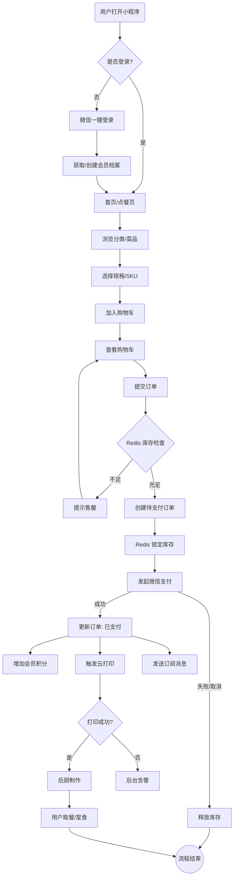
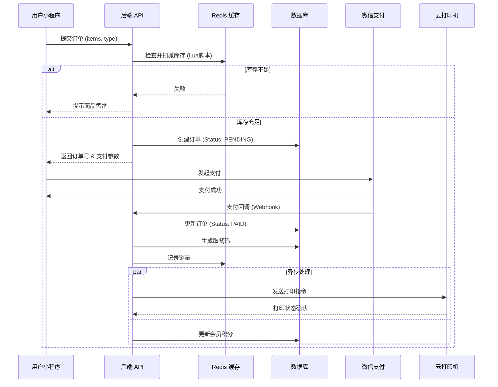

# 功能规格说明书 (Functional Specs)

## 1. 核心业务流程
本系统核心在于解决“高峰期快速点餐”与“后厨自动化接单”。

### 用户点餐主流程 (User Order Flow)

## 2. 模块功能详解

### 2.1 用户端 (Mini Program)
*   **身份识别**：基于 `openid` 自动登录，静默注册。
*   **点餐模式**：
    *   **堂食**：选择桌号（可选）或直接下单（凭流水号取餐）。
    *   **自提**：预约时间（可选），生成取餐码。
*   **菜单展示**：支持二级分类锚点导航，支持多规格（如：辣度、加料）。
*   **订单中心**：查看进行中订单、历史订单、申请退款（仅限未制作/待接单状态，具体策略可配置）。

### 2.2 订单与支付 (Order & Pay)
*   **防超卖机制**：下单时在 Redis 中 `decr` 库存，支付超时（如 15分钟）自动归还。
*   **支付状态机**：
    *   `PENDING` (待支付)
    *   `PAID` (已支付/制作中)
    *   `COMPLETED` (已完成)
    *   `CANCELLED` (已取消/超时)
    *   `REFUNDING` (退款中)
    *   `REFUNDED` (已退款)
*   **云打印逻辑**：
    *   监听支付成功事件 -> 组装打印模板（店铺名、流水号、菜品、备注、时间） -> 调用云打印机 API（如飞鹅/易联云）。

### 2.3 接口协作时序 (Sequence Diagram)

## 3. 管理端功能 (Admin Dashboard)
*   **菜品管理**：
    *   CRUD 菜品，关联分类。
    *   设置 SKU（价格、库存、成本）。
    *   上下架控制。
*   **订单管理**：
    *   实时接单列表（轮询/WebSocket）。
    *   主动退款审核。
    *   补打小票功能。
*   **数据报表**：
    *   日/月销售额统计。
    *   热销菜品排行。

## 4. 异常处理与风险
| 风险点 | 触发场景 | 应对策略 |
| :--- | :--- | :--- |
| **支付回调丢失** | 网络波动/微信侧延迟 | 1. 客户端轮询查单接口 2. 后端定时任务主动查询微信订单状态 |
| **打印机不出单** | 设备离线/缺纸 | 1. 接口返回打印失败状态 2. 后台醒目提示“打印失败” 3. 支持手动重新下发打印 |
| **库存死锁** | 用户下单后不支付 | 设置 Redis Key 过期时间（如 15min），过期监听事件或定时任务回滚库存 |
