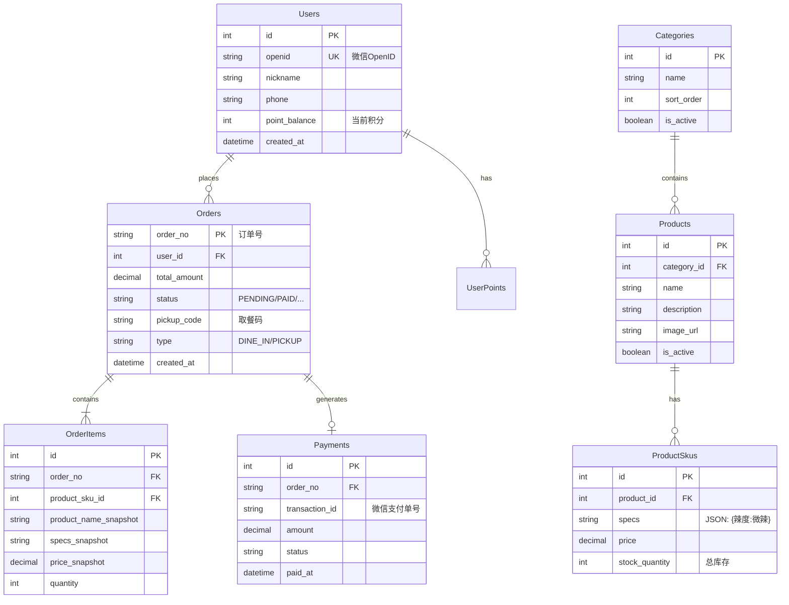

# 数据模型设计 (Data Model)

## 1. 数据库设计 (PostgreSQL)

本系统采用关系型数据库存储核心业务数据。

### 实体关系图 (ER Diagram)

## 2. 关键表结构说明

### 2.1 菜品 SKU 表 (`product_skus`)
为了支持灵活的规格（如大份/小份，微辣/特辣），建议使用 SKU 设计。
*   `specs`: 存储 JSON 字符串，例如 `{"size": "L", "spicy": 1}`。
*   `stock_quantity`: 数据库层面的库存兜底。

### 2.2 订单表 (`orders`)
*   `status`: 状态机字段，必须有索引。
*   `pickup_code`: 当日唯一的短号（如 A102），每天重置。

## 3. Redis 数据结构设计

Redis 用于高频读写和临时状态。

| Key 模式 | 类型 | 用途 | TTL |
| :--- | :--- | :--- | :--- |
| `sku:stock:{{sku_id}}` | String (Int) | 实时库存扣减 | 长期 |
| `order:lock:{{order_no}}` | String | 订单支付锁定标识 | 15 min |
| `daily:seq:{{date}}` | String (Incr) | 生成每日取餐流水号 | 24 hours |
| `cart:{{user_id}}` | Hash | 用户购物车缓存（可选） | 7 days |
| `access_token:admin` | String | 管理员登录 Token | 2 hours |

## 4. 数据一致性策略
1.  **库存同步**：
    *   初始化时，将 DB 库存加载到 Redis。
    *   Redis 扣减成功后，异步（或定期）同步回 DB，或在支付成功回调中扣减 DB 库存。
    *   本方案推荐：**下单预扣 Redis -> 支付成功实扣 DB**。

2.  **每日流水号重置**：
    *   使用 Redis `INCR` 操作，Key 包含日期（如 `daily:seq:20260309`），自然过期。
