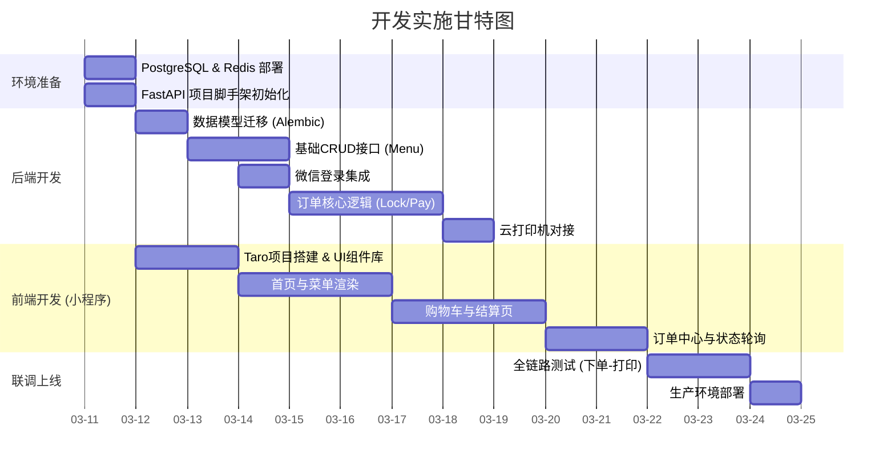

# 实施与接口计划 (Implementation)

## 1. API 接口规划 (Backend)
所有接口前缀建议为 `/api/v1`。

### 1.1 认证与用户 (Auth)
*   `POST /auth/login/wechat`: 微信小程序登录，换取 Token。
*   `GET /user/profile`: 获取用户信息及积分。
*   `PUT /user/phone`: 更新手机号（需微信授权）。

### 1.2 菜单与商品 (Menu)
*   `GET /categories`: 获取分类列表。
*   `GET /products`: 获取商品列表（支持按分类筛选）。
*   `GET /products/{{id}}`: 获取商品详情及 SKU。

### 1.3 订单与支付 (Order)
*   `POST /orders/preview`: 订单预览（计算优惠、运费）。
*   `POST /orders`: **核心** 创建订单（扣库存、生成订单号）。
*   `POST /orders/{{order_no}}/pay`: 发起支付，返回微信支付参数。
*   `GET /orders`: 订单列表。
*   `GET /orders/{{order_no}}`: 订单详情（含状态、取餐码）。
*   `POST /orders/{{order_no}}/cancel`: 取消订单（释放库存）。
*   `POST /webhook/wechat/pay`: 微信支付异步回调入口。

### 1.4 管理端 (Admin)
*   `POST /admin/products`: 创建商品。
*   `PATCH /admin/products/{{id}}/stock`: 调整库存。
*   `GET /admin/orders`: 订单查询（支持状态过滤）。
*   `POST /admin/orders/{{order_no}}/refund`: 发起退款。

## 2. 开发路线图 (Implementation Roadmap)



## 3. 目录结构规范 (Directory Structure)

```text
/backend
  /app
    /api            # 路由定义
    /core           # 配置、安全、数据库连接
    /models         # SQLModel/SQLAlchemy 模型
    /schemas        # Pydantic 响应/请求模型
    /services       # 业务逻辑 (OrderService, PayService)
    /utils          # 工具 (WeChat SDK, Printer SDK)
  main.py
  requirements.txt

/frontend-miniapp   # Taro Vue3 项目
  /src
    /api            # 接口封装
    /components     # 公共组件
    /pages          # 页面 (Home, Cart, Order, User)
    /stores         # Pinia 状态管理 (CartStore)
    app.config.ts

/frontend-admin     # Vue3 Admin 项目
```

## 4. 下一步行动
1.  **执行数据库迁移**：建立 `users`, `products`, `orders` 表。
2.  **配置环境**：申请微信小程序 AppID、微信支付商户号、云打印机开发者账号。
3.  **开始编码**：按照 `plan_01` 中的里程碑顺序启动 `dev1` 阶段。
